# Cortex architecture

> Canonical architecture guide for the current Cortex repository.
>
> **Software/runtime:** `v1.0.0-rc.2`  
> **Frozen executable specification:** `spec-v0.9.5`  
> **Research frontier:** `v1.13-R+`

Cortex is an experimental architecture for **resource-bounded continual structural reasoning**.

The shortest useful description is:

> Cortex turns a chronological stream of structured observations into a bounded, revisable model of **what persists, what relates, what recurs, what changes, what should split, what can merge again, and what remains unresolved**.

It is not a foundation model and it is not a raw perception model. It can consume vectors produced by a neural encoder, but the stable native runtime is designed to operate **after perception**, where the main problem is no longer "what pixels are present?" but rather:

- Is this the same entity as before?
- Which transformations should count as irrelevant nuisance variation?
- Which relations are becoming reliable?
- Which changes represent recurrence, adaptation, or novelty?
- Is one existing concept hiding multiple predictively different regimes?
- Can two previously separated concepts be safely merged again?
- What should the system do when its finite representation budget is exhausted?

This document explains how the current implementation answers those questions.

---

## 1. The mental model

A useful way to think about Cortex is as four interacting forms of memory:

1. **Entity memory** — persistent identities and nuisance-invariant prototypes.
2. **Relational memory** — sparse evidence about relations and directional causal effects.
3. **Historical memory** — bounded fuzzy prototypes that summarize recurring articulation states.
4. **Continual structural memory** — predictive regimes that may adapt, recur, split, merge, or be declared novel.

A frame enters at the top and becomes progressively more structural.

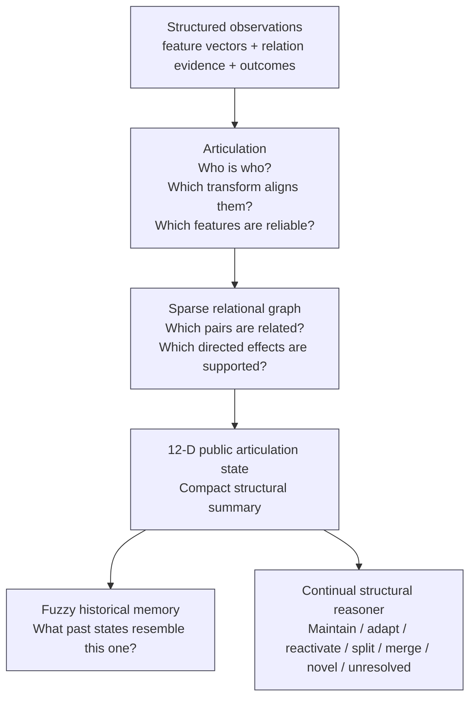

The most important detail in this diagram is the fork after the 12-dimensional articulation vector:

> **Historical memory and continual reasoning consume the same public articulation state independently.**

The reconstruction produced by fuzzy historical memory is deliberately **not** fed back into the continual core in the current frozen semantics. This prevents approximate memory compression from silently rewriting active structural state.

---

## 2. Stable runtime versus research frontier

Cortex currently has three version coordinates because they serve different purposes.

| Layer | Meaning | Current state |
|---|---|---|
| Software release | The packaged Rust/Python implementation | `v1.0.0-rc.2` |
| Executable specification | The frozen behavioral oracle | `spec-v0.9.5` |
| Research frontier | Experimental mechanisms not yet promoted into the runtime contract | `v1.13-R+` |

This separation is architectural, not administrative.

The stable native runtime implements the current published behavioral contract. New research mechanisms such as fuzzy predictive fields, local adaptive resolution, support-sparse prediction, and kinship relation algebra are evaluated separately until they are mature enough to justify a new executable specification.

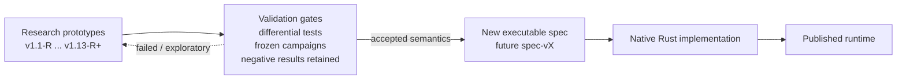

The current `spec-v0.9.5` is immutable. Research does not silently mutate it.

---

## 3. One frame through Cortex

The native top-level object is `NativeCortexRuntime` in `cortex-runtime`.

A call to `step(...)` receives:

- a list of detection/observation vectors;
- optional binary relation observations between detections;
- an optional intervention source;
- optional binary target outcomes for causal evidence;
- an optional scalar outcome for the continual predictive core.

The transition is coarse-grained and stateful.

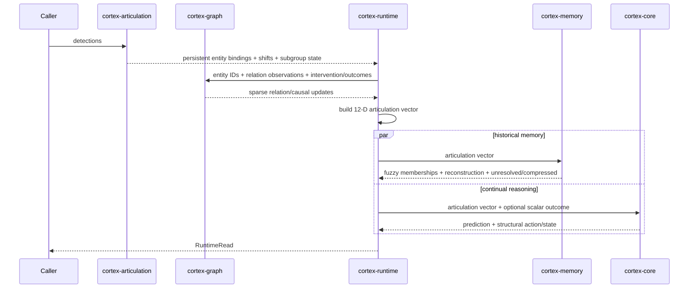

In pseudocode, the production path is intentionally simple:

```text
articulation = articulation.observe(detections)
bindings     = convert_to_graph_node_ids(articulation.bindings)

graph = graph.observe(
    bindings,
    relation_observations,
    intervention_source,
    target_outcomes,
)

z = build_articulation_vector(articulation_state, graph_summary)

memory_read    = memory.step(z)
continual_read = continual.step(z, optional_outcome)

return all reads
```

The system therefore has one explicit public structural bottleneck:

$$
z_t in \mathbb{R}^{12}.
$$

Everything below articulation and graph evidence is conditioned on this compact state.

---

# Part I — Articulation

## 4. What "articulation" means in Cortex

Articulation is the process of turning raw feature vectors into persistent, structured entities.

Suppose a frame contains detections

$$
x_1,\ldots,x_k in \mathbb{R}^d.
$$

Cortex must decide whether each detection corresponds to:

- an existing persistent entity;
- an existing entity under an allowed nuisance transformation;
- or a genuinely new entity.

At the same time it learns which feature dimensions are trustworthy and which nuisance transformations are consistently supported by evidence.

The stable implementation uses **cyclic coordinate shifts** as its native nuisance group. This is deliberately a simple, auditable transformation family. For generic neural embeddings the hybrid adapter normally disables this mechanism and uses the identity transformation only.

---

## 5. Entity prototypes and reliability

Every persistent entity stores running evidence including:

- accumulated aligned feature values;
- observation count;
- most recent raw observation;
- per-feature anomaly evidence;
- a prototype vector;
- a per-feature reliability vector;
- a per-feature discrete noise state.

For entity $e$, the prototype is the running aligned mean:

$$
\mu_e(f)
=
\frac{1}{n_e}
\sum_{t in e}
x_t^{\text{aligned}}(f).
$$

Feature reliability is derived from anomaly evidence. A feature repeatedly behaving like unexplained noise is downweighted during matching.

The matching distance is a weighted mean squared error:

$$
d_w(x,y)
=
\frac{
\sum_f w_f(x_f-y_f)^2
}{
\sum_f w_f
}.
$$

This matters because identity should not depend equally on dimensions that the system has learned are unstable.

---

## 6. Nuisance transformations

For an existing entity $e$, Cortex evaluates the observation against transformed versions of the prototype:

$$
gcdot\mu_e,
\qquad
g\in G.
$$

For each candidate transformation,

$$
c_g
=
d_w(x,gcdot\mu_e).
$$

The best transform determines the hard alignment used for the state update, but Cortex also computes a soft transform-evidence distribution:

$$
q(g)
=
\frac{
\exp(-\beta c_g)
}{
\sum_h \exp(-\beta c_h)
}.
$$

So the architecture distinguishes:

- **the selected alignment** used operationally;
- **the distribution of evidence over alignments** used for nuisance-structure learning.

---

## 7. Global simultaneous binding

A subtle but important constraint is that Cortex does not greedily bind detections one at a time.

It builds a cost matrix for the complete frame and solves a rectangular Hungarian assignment problem.

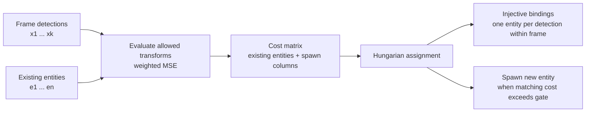

Spawn columns are added to the assignment matrix. Therefore "create a new identity" participates in the same optimization as "reuse an existing identity."

The resulting binding must be **injective within the frame**: two simultaneous detections cannot be assigned to the same persistent entity.

This avoids a common tracking failure where locally plausible greedy matches become globally inconsistent.

---

## 8. Learning the active nuisance subgroup

Cortex does not automatically prefer maximal invariance.

It accumulates transformation evidence and compares candidate transformation groups. A candidate is rewarded when its member transformations consistently explain observations, with evidence normalized by group size.

The active subgroup is used only when evidence has become sufficiently decisive. Otherwise Cortex remains conservative and retains the larger candidate set.

The runtime exposes both:

- the selected subgroup;
- a **subgroup evidence margin** representing confidence in that choice.

This is architecturally important:

> invariance itself is learned under evidence rather than treated as a free simplification.

---

## 9. Residual and noise state

After alignment, Cortex computes the residual between the aligned observation and the entity prototype.

Per feature, repeated large residuals accumulate evidence that the dimension behaves like noise. Repeated small residuals accumulate evidence that it reflects stable structure.

The native discrete states are conceptually:

| State | Interpretation |
|---|---|
| structure-supported | residuals are persistently small |
| unresolved | insufficient or ambiguous evidence |
| noise-supported | residuals are persistently anomalous |

The public articulation vector does not expose every feature state separately. Instead it exposes the **fractions** of feature coordinates currently in these categories.

---

# Part II — Sparse relational structure

## 10. Why the graph is sparse

If Cortex tracks (N) entities, a naïve relation system allocates all

$$
O(N^2)
$$

possible pairs.

The native graph does not.

A relation or causal cell is created only after the stream supplies evidence for that pair.

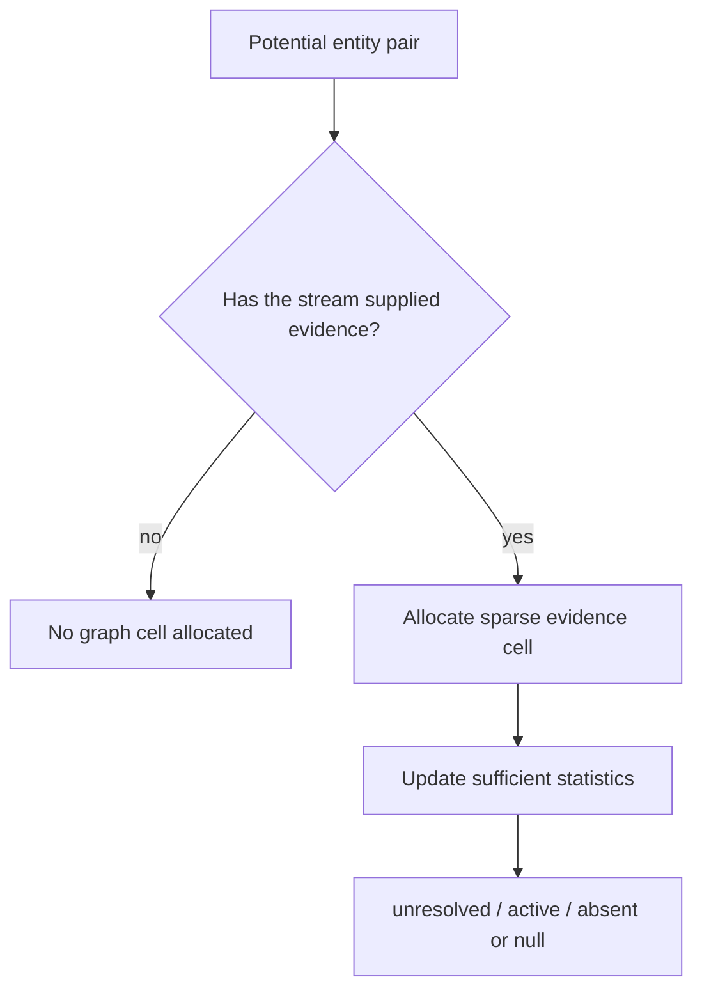

Worst-case storage can still become quadratic if evidence genuinely touches every pair. The important guarantee is narrower:

> Cortex does not pay quadratic storage merely because the pairs are theoretically possible.

---

## 11. Relation evidence

Undirected relation cells maintain Beta-style sufficient statistics.

Conceptually, after binary observations $y ∈ {0,1}$,

$$
a leftarrow a+y,
\qquad
b leftarrow b+(1-y).
$$

The posterior mean is

$$
\hat p
=
\frac{a}{a+b}.
$$

After a minimum number of exposures, configured thresholds classify the pair as:

- **active**;
- **absent**;
- or **unresolved**.

Until enough evidence exists, the graph explicitly remains unresolved.

---

## 12. Intervention-sensitive causal evidence

Directional causal cells distinguish observations collected:

- when a source entity was the declared intervention source;
- from matched control observations.

Each directed pair stores separate Beta-style sufficient statistics for intervention and control.

If

$$
p_{\text{do}}
=
\frac{a_{\text{do}}}{a_{\text{do}}+b_{\text{do}}},
\qquad
p_{\text{ctrl}}
=
\frac{a_{\text{ctrl}}}{a_{\text{ctrl}}+b_{\text{ctrl}}},
$$

then evidence is based on

$$
\Delta
=
p_{\text{do}}-p_{\text{ctrl}}.
$$

With enough intervention and control samples:

- sufficiently positive $Δ$ supports a causal edge;
- sufficiently small $|Δ|$ supports a null edge;
- intermediate evidence remains unresolved.

This is not a full causal-discovery framework. It is an explicit online evidence contract for intervention-sensitive directional effects.

---

## 13. Local dependency closure

The graph crate also provides a directed dependency graph.

When a node becomes dirty, Cortex can compute the transitive closure of only its dependents:

$$
\operatorname{closure}(S)
=
S
\cup
{v : \exists u\in S,; u\leadsto v}.
$$

This supports a broader architectural principle:

> local change should reopen only the structure that depends on it unless a global witness requires more.

---

# Part III — The 12-dimensional public articulation state

## 14. Why compress the structural state

Articulation and graph state can be large:

- many entity prototypes;
- many feature reliabilities;
- many residual/noise states;
- many sparse relation and causal cells.

The continual reasoner does not consume this complete internal state directly.

Instead, `cortex-runtime` constructs a fixed 12-dimensional public summary:

$$
z_t in \mathbb{R}^{12}.
$$

This creates a stable contract between "perceptual/relational articulation" and "continual structural reasoning."

The current coordinates are:

| Index | Meaning |
|---:|---|
| 0 | active entity fraction relative to configured entity capacity |
| 1 | normalized nuisance-subgroup evidence margin |
| 2–5 | one-hot indicators for up to four configured/default nuisance groups |
| 6 | fraction of residual features supporting stable structure |
| 7 | fraction of residual features unresolved |
| 8 | fraction of residual features supporting noise |
| 9 | fraction of possible entity pairs with active relations |
| 10 | fraction of possible entity pairs whose relation state is resolved |
| 11 | fraction of possible directed entity pairs with active causal evidence |

The last three denominators are based on the complete active entity population, not merely allocated sparse cells. An unallocated pair therefore has the same unresolved meaning it had in the frozen dense reference.

This is a good example of an implementation optimization that preserves semantics:

$$
\text{sparse storage}

\neq
\text{different meaning}.
$$

---

# Part IV — Fuzzy historical memory

## 15. The role of historical memory

The `cortex-memory` crate implements **Fuzzy Accordion Memory**.

Its purpose is not to choose the active regime. Instead it answers a different question:

> Which previously stored structural states resemble the current one, and can history be compressed without exceeding a declared distortion budget?

For prototypes $c_i$, Cortex computes RMS distances

$$
d_i
=
\operatorname{RMS}(z,c_i)
$$

and fuzzy membership scores

$$
m_i
=
\frac{
\exp(-d_i/\tau)
}{
\\sum_j \exp(-d_j/\tau)
}.
$$

An α-cut determines which memories are considered actively relevant.

The reconstruction is the membership-weighted prototype mixture:

$$
\hat z
=
\frac{
\sum_i m_i c_i
}{
\sum_i m_i
}.
$$

---

## 16. Memory update policy

Historical memory follows a bounded decision process.

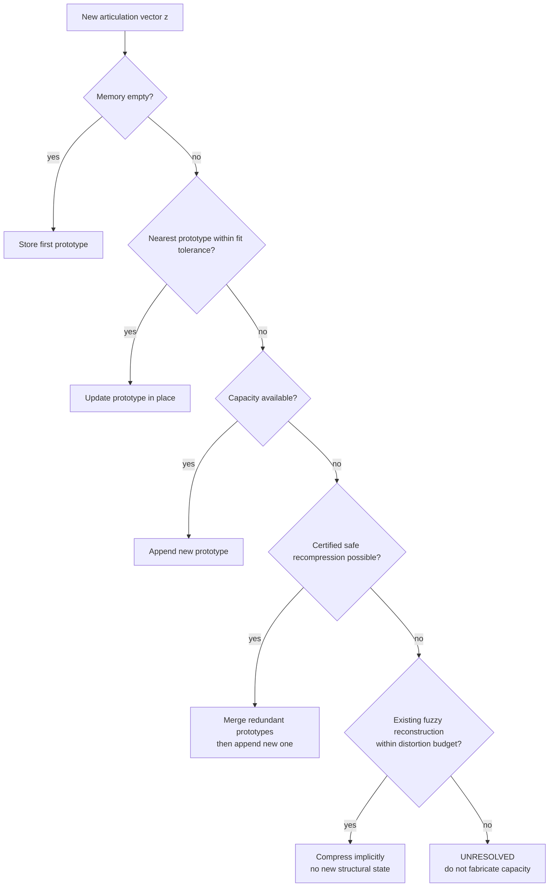

The term **certified recompression** means that two stored prototypes may be merged only when:

1. they are sufficiently redundant;
2. their weighted merged prototype stays within the configured distortion budget.

The system therefore does not silently delete information simply because memory is full.

---

## 17. Why memory reconstruction does not drive the continual core

This boundary is intentional.

A fuzzy memory reconstruction is an approximation:

$$
z_t
mapsto
\hat z_t.
$$

If the continual reasoner consumed $\hat z_t$, then a storage optimization could alter active structural decisions.

The current runtime instead sends the original public articulation vector (z_t) to both consumers:

```text
                 ┌──> historical memory
articulation z ──┤
                 └──> continual reasoner
```

Thus:

> approximate historical storage cannot silently rewrite the present.

---

# Part V — Continual structural reasoning

## 18. Regime prototypes

The `cortex-core` crate maintains bounded predictive regimes.

Each regime prototype stores, among other fields:

- a stable unique ID;
- a centroid in the 12-D articulation space;
- soft count and utility;
- predictive successes/failures;
- creation and last-use times;
- recent predictive statistics;
- lineage information for splits;
- refinement depth.

Given the current state (z_t), Cortex computes distances to all prototypes and soft memberships similar to fuzzy memory:

$$
m_i
\propto
\exp(-d_i/\tau).
$$

These memberships contribute to prediction and to decisions about whether the current state belongs to:

- the current regime;
- another known regime;
- or no known regime.

---

## 19. The structural action vocabulary

At a high level, the continual core implements the following decision vocabulary:

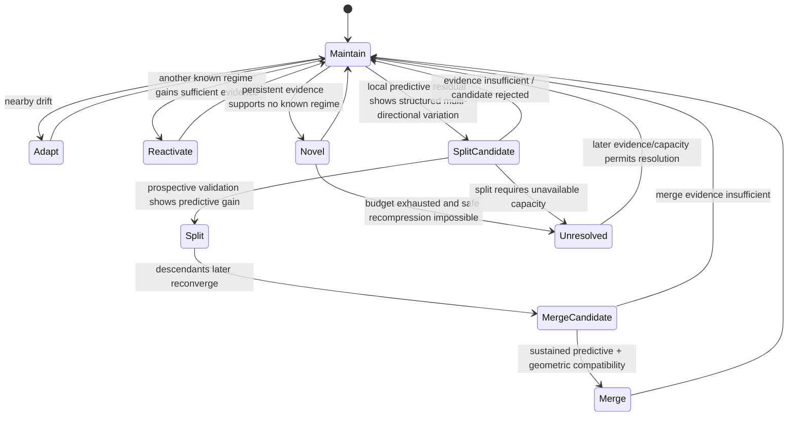

This diagram is conceptual: the implementation exposes booleans and counters rather than a single explicit enum for every arrow. But the behavioral contract follows this logic.

---

## 20. Maintain and adapt

If the current observation remains sufficiently close to the active regime, Cortex stays in place.

Small local drift updates the existing regime rather than creating a new one.

This is the default bias:

$$
\text{adapt existing structure}
<
\text{create new structure}
$$

unless evidence justifies the latter.

---

## 21. Recurrence and reactivation

If the current regime no longer fits but another stored regime is sufficiently plausible, Cortex accumulates recurrence evidence.

Only when that evidence passes a threshold does the active regime switch.

Thus recurrence is not represented as:

> "This looks different from now, therefore it is new."

Instead:

> "This looks inconsistent with now, but consistent with a previously known state."

A successful switch is recorded as **reactivation**, not discovery.

---

## 22. Novelty and explicit budget pressure

If the observation is far from both:

- the current regime;
- and every known regime,

Cortex accumulates novelty evidence.

When novelty evidence crosses threshold, Cortex attempts to store a new regime.

If capacity exists, or if a safe recompression can free capacity, the regime is created.

Otherwise:

$$
\boxed{
\text{novel evidence}
+
\text{no safe capacity}
\Rightarrow
\text{unresolved + budget pressure}
}
$$

not "pretend the closest existing regime is correct."

This is one of the central Cortex invariants.

---

# Part VI — Conditional predictive refinement

## 23. Why Cortex has a tensor side path

A regime centroid can be a good coarse model while still hiding a structured predictive residual.

For example, two observations may occupy nearly the same structural region but have systematically different outcomes along some local direction.

The continual core therefore maintains a small conditional tensor/residual system per regime.

Its purpose is diagnostic and corrective:

1. detect coherent predictive residual structure;
2. provide a low-amplitude predictive correction;
3. monitor whether residual geometry suggests that the regime itself may need to split.

The tensor machinery is conditional: it can sleep, wake, refresh, and run in bursts. This prevents expensive refinement work from becoming permanently active when it is not useful.

---

## 24. Curvature and rank evidence

For an active regime with centroid (mu), define local displacement

$$
\delta_t = z_t-mu.
$$

With predictive residual

$$
e_t = y_t-\hat y_t,
$$

the core maintains a curvature-like matrix using terms of the form

$$
e_t,\\delta_t\\delta_t^\top.
$$

The implementation periodically examines the eigenspectrum of this matrix.

If significant structure persists in more than one direction, the regime becomes a candidate for refinement.

This is not enough to split.

It is only a **proposal mechanism**.

That distinction is fundamental:

> suspicious geometry may propose a structural distinction; only future predictive evidence may promote it.

---

## 25. Prospective split validation

When a split candidate is launched, Cortex creates temporary **shadow directions** rather than immediately modifying active state.

For candidate direction (u), observations are provisionally separated by the sign of

$$
u^\top(z-mu).
$$

Cortex then compares:

- the predictive loss of the unsplit parent;
- the predictive loss of the provisional two-branch model.

The candidate moves through two phases:

1. **selection** — compare candidate directions;
2. **validation** — evaluate the best candidate prospectively on later evidence.

A split is promoted only if:

- both branches receive enough evidence;
- mean predictive gain exceeds threshold;
- gain exceeds an explicit complexity penalty;
- the two resulting centroids are not effectively redundant;
- budget permits the new representation.

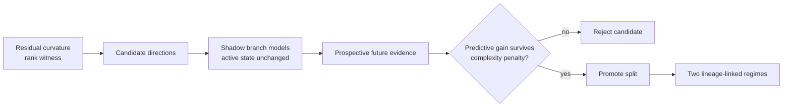

This is one of the strongest architectural protections against overfitting.

---

## 26. Merge and reversibility

A structural distinction is not permanent merely because it was once useful.

Split descendants retain lineage information. Cortex periodically asks whether they have reconverged sufficiently in:

- geometry;
- predictive behavior;
- recent evidence.

Only after persistent merge evidence are descendants recombined.

Therefore the structure is **reversible**:

$$
\text{coarse}
\rightarrow
\text{split}
\rightarrow
\text{coarse again}.
$$

This is architecturally different from systems where model complexity only grows.

---

# Part VII — Boundedness and uncertainty

## 27. Bounded state is a design constraint

Several parts of Cortex have explicit budgets:

- maximum active entities;
- historical memory budget;
- continual regime budget;
- refinement depth;
- conditional tensor activity/refresh policy;
- sparse graph allocation only after evidence.

Fixed configuration therefore induces explicit finite bounds on important state components.

But Cortex does not treat "bounded" as "always able to explain everything."

When the system cannot represent new evidence without violating its declared resource or distortion contract, it exposes the failure.

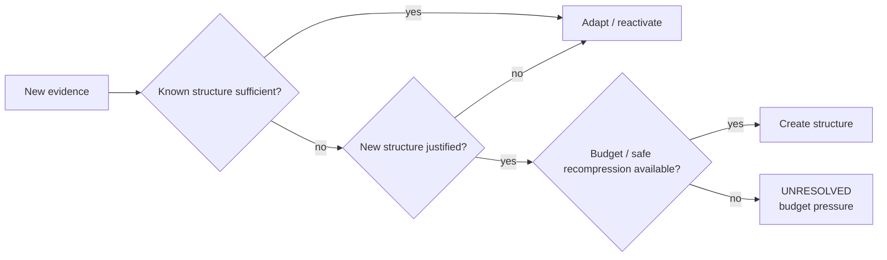

The governing principle is:

$$
\boxed{
\text{resource exhaustion must reduce certainty, not fabricate certainty.}
}
$$

---

# Part VIII — Snapshots, observability and provenance

## 28. Inspectable state

Each major layer exposes a serializable snapshot.

The runtime snapshot contains:

- articulation state;
- sparse graph state;
- fuzzy memory state;
- continual reasoner state;
- the current 12-D articulation vector.

This matters for two reasons.

First, Cortex is intended to be inspectable: structural changes should be visible rather than buried in an opaque hidden state.

Second, the native implementation is validated through deterministic differential replay against the frozen Python specification.

---

## 29. Differential implementation contract

The native Rust implementation is not considered correct because it "looks similar" or because benchmark averages match.

For shared semantics, deterministic fixtures compare:

- numerical predictions;
- entity bindings;
- relation/causal state transitions;
- memory behavior;
- regime decisions;
- split/merge behavior;
- final snapshots.

Floating-point outputs use explicit tolerances. Discrete structural decisions are expected to agree.

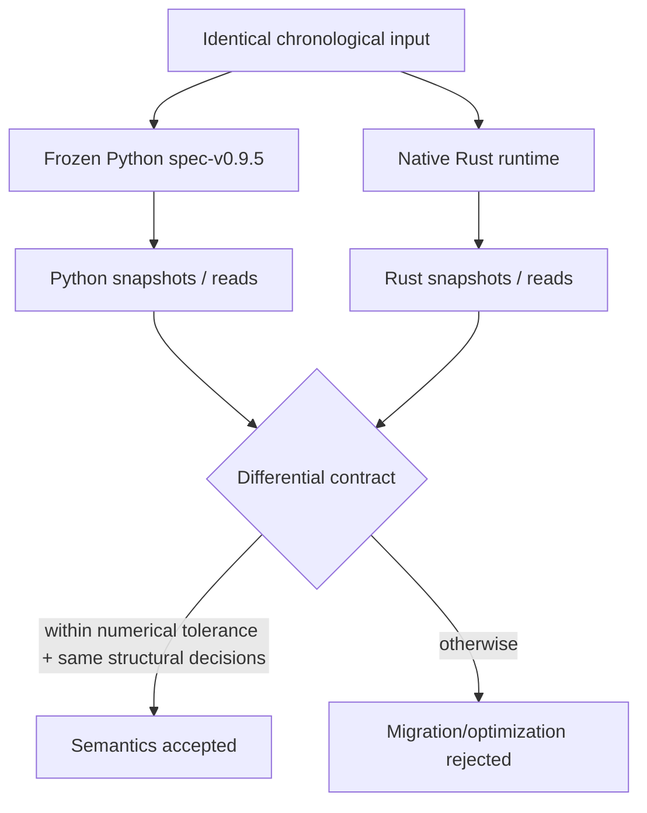

This makes optimization safer: performance work can be rejected if it silently changes reasoning semantics.

---

# Part IX — Hybrid neural/Cortex architecture

## 30. Cortex does not require hand-engineered input features

Stage-I Hybrid Cortex places a frozen neural encoder in front of the unchanged native runtime.

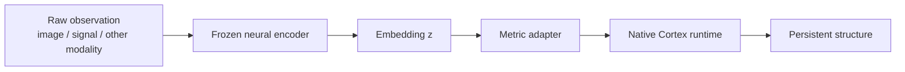

For a $d$-dimensional embedding $z$, the adapter uses

$$
x
=
\sqrt{\frac d2}
\frac{z}{\|z\|_2}.
$$

For two adapted embeddings $x_a,x_b$, ordinary unweighted MSE becomes exactly cosine distance between the original embeddings:

$$
\operatorname{MSE}(x_a,x_b)
=
1-\cos(a,b).
$$

This gives Cortex's existing metric thresholds a defined interpretation instead of allowing arbitrary neural embedding magnitudes to control identity decisions.

Generic embeddings use a fixed identity nuisance group because cyclic shifts of latent coordinates generally have no semantic meaning.

---

## 31. Why the encoder is frozen in Stage I

The one-way boundary is deliberate:

$$
\text{encoder}
\rightarrow
\text{Cortex}.
$$

If both systems learned simultaneously, it would be difficult to determine whether a performance gain came from:

- better neural features;
- Cortex structural reasoning;
- or feedback between them.

Stage I isolates the question:

> Given a fixed representation, does Cortex add useful persistent structural reasoning?

Only after that is established should a Stage II experiment consider

$$
\text{encoder}
leftrightarrow
\text{Cortex}.
$$

---

# Part X — Research architecture beyond the frozen runtime

## 32. Predictive semantic fields

The current research frontier asks whether Cortex should preserve a distinction merely because perception can see it.

The research answer is increasingly:

> preserve distinctions only when they matter to prediction.

Instead of treating every perceptual anchor as a hard ontological entity, the fuzzy predictive-field research maintains responsibilities over anchors and derives semantic distance from their learned future distributions.

At candidate resolution $ρ$,

$$
K_\rho(i,j)
=
exp
\left[
-\frac{d_P(i,j)^2}{2\rho^2}
\right].
$$

This supports a continuum:

$$
\text{fine distinction}
\longleftrightarrow
\text{predictive equivalence}.
$$

---

## 33. Predictive rate-distortion

Research v1.7-R formalized adaptive resolution as:

$$
\rho_t^*
=
\arg\min_\rho C_t(\rho)
\quad
\text{subject to}
\quad
D_t(\rho)
\le
D_t^{\min}+\varepsilon.
$$

In plain language:

> choose the simplest representation whose predictive error remains close enough to the best available representation.

This is stronger than minimizing an arbitrary weighted sum of accuracy and complexity because the acceptable predictive distortion is explicit.

---

## 34. Hysteretic local resolution

A globally selected resolution can oscillate and can waste detail where only one part of the field needs refinement.

The research line therefore introduced:

- **hysteresis** — sharpen quickly, coarsen only after sustained evidence;
- **local resolution** — different anchors may use different predictive resolution.

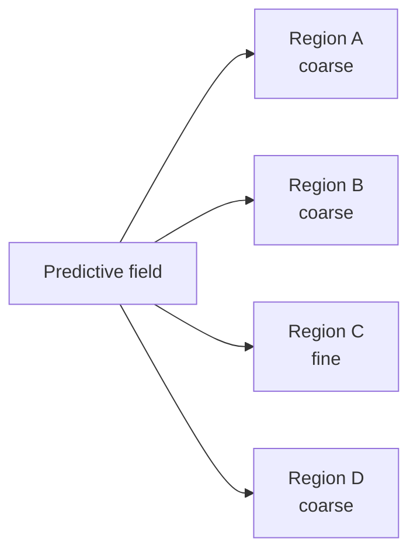

The interpretation is important:

> representation complexity is allocated where predictive evidence requires distinction.

It is not uniformly increased across the whole model.

---

## 35. Relational reasoning research

Cortex now has two complementary relation-reasoning research tracks.

### Prospective multi-hop relational inference

A learned graph diffusion operator can assign high potential to previously unseen pairs connected through indirect evidence.

The heat kernel

$$
K_\rho
=
e^{-\rho L}
$$

implicitly contains contributions from paths of many lengths.

Controlled experiments demonstrated unseen-pair prediction at first supporting depths 3, 5, and 7.

### Typed relational composition

The newer kinship-composition experiment adds a finite learned relation algebra.

Conceptually,

$$
s_{t+1}
=
C(s_t,r_t),
$$

where (C) is learned from solved relation paths.

After training only on paths of length at most 5, the research prototype generalized recursively to unseen entities and path lengths 6–10.

This capability is currently a **research module**, not part of the stable native runtime.

---

# Part XI — Measured performance architecture

## 36. Why Cortex is implemented as one coarse native transition

The first migration experiments showed that moving only isolated numerical kernels to Rust did not produce the expected full-stack speedup.

The large improvement appeared when the complete stateful frame transition moved behind one Rust boundary.

On the declared 1,400-frame benchmark:

| Execution mode | Mean step | Peak RSS |
|---|---:|---:|
| Frozen Python | 10,315.3 µs | 87.43 MiB |
| Hybrid | 10,141.9 µs | 86.93 MiB |
| Fully native | **78.66 µs** | **21.99 MiB** |

On that workload this corresponds to roughly:

$$
131\times
$$

lower mean step time and about

$$
4\times
$$

lower peak process memory.

These are workload-specific measurements, not universal complexity claims.

---

## 37. Where native runtime time currently goes

The top-level `stage-attribution-v1` campaign found articulation to dominate the measured native runtime.

For the baseline profiling case, attributed work was approximately:

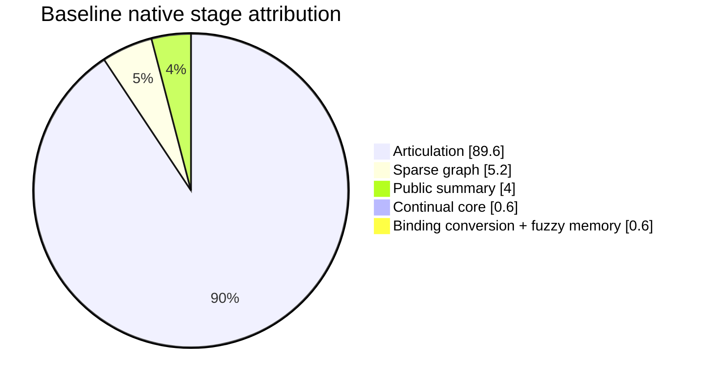

This chart is workload-specific.

A second profiler then decomposed articulation itself and found cyclic transform-distance evaluation to dominate that stage. This is why current native optimization work targets exact transform-distance kernels rather than, for example, replacing the Hungarian assignment algorithm.

Measured bottlenecks determine optimization priority.

---

# Part XII — Complexity map

## 38. Approximate scaling surfaces

The exact cost depends strongly on configuration and realized state, but the main scaling surfaces are understandable.

Let:

- (k) = detections visible in the current frame;
- (N) = active persistent entities;
- (d) = articulation feature dimension;
- (|G|) = active nuisance-transform count;
- (R) = represented sparse relation cells;
- (C) = represented causal cells;
- (B_m) = fuzzy-memory prototype count;
- (B_r) = continual regime count.

A rough architecture-level map is:

| Component | Dominant scaling idea |
|---|---|
| Entity/transform scoring | approximately (O(kN|G|d)) |
| Hungarian assignment | polynomial in the frame assignment matrix; measured smaller than transform scoring in current fixtures |
| Current-frame relation updates | approximately quadratic in visible entities, not total entity capacity |
| Stored graph memory | (O(R+C)), allocated from observed evidence |
| Public 12-D summary | constant-dimensional output; graph counts maintained incrementally |
| Fuzzy memory matching | approximately O(B_m · 12) |
| Continual regime matching | approximately O(B_r · 12) |
| Exact curvature rank checks | dense in the fixed continual dimension and conditional/sampled rather than every frame |

These expressions are architectural guides, not formal asymptotic theorems for every code path.

---

# Part XIII — Design invariants

## 39. The invariants that define Cortex

The architecture is easier to understand if its implementation details are summarized as a small set of invariants.

### 39.1 Evidence before structure

A structural distinction is not created merely because one observation is surprising.

Persistent evidence is required.

### 39.2 Recurrence before rediscovery

If a known structure explains the observation, reactivate it rather than creating a duplicate.

### 39.3 Adapt before proliferating

Nearby drift should modify an existing representation unless predictive evidence justifies another.

### 39.4 Prediction before split

Geometric complexity may propose a split; future predictive gain must validate it.

### 39.5 Reversibility

A distinction that stops mattering should be allowed to merge again.

### 39.6 Boundedness is explicit

Entity, memory and regime capacities are configuration contracts rather than accidental machine limits.

### 39.7 Uncertainty is a valid output

When evidence or capacity is insufficient, `unresolved` is preferable to unsupported certainty.

### 39.8 Approximate memory does not control active truth

Historical compression cannot silently rewrite the present structural state.

### 39.9 Research does not silently redefine production semantics

New mechanisms must survive their own validation and specification process before entering the stable runtime.

---

# Part XIV — Repository map

## 40. Where the architecture lives

```text
crates/
  cortex-articulation/
      Persistent entity identity
      Nuisance-transform evidence
      Simultaneous assignment
      Reliability and residual/noise state

  cortex-graph/
      Sparse relation evidence
      Intervention-sensitive causal evidence
      Dependency closure

  cortex-memory/
      Bounded fuzzy historical memory
      Certified recompression
      Explicit unresolved state

  cortex-core/
      Continual regime prototypes
      Recurrence / adaptation / novelty
      Conditional tensor refinement
      Curvature/rank diagnostics
      Prospective split validation
      Merge/reconciliation

  cortex-runtime/
      Coarse-grained composition
      12-D public articulation state
      Runtime snapshots
      Optional profiling path

  cortex-python/
      PyO3 boundary for research and Python callers

python/cortex/
  hybrid.py
      Frozen-neural-encoder adapter

research/
      Experimental predictive geometry,
      adaptive resolution,
      relational inference,
      logical composition, and campaigns

reference/v0_9_5/
      Immutable Python executable specification

benchmarks/
      Performance and scientific campaign runners

benchmarks/results/
      Committed aggregate benchmark summaries

tests/
      Unit, differential, migration, hybrid, and research tests
```

---

# Part XV — What Cortex is not

## 41. Non-claims

The current architecture should not be described as:

- a general-purpose replacement for neural networks;
- a universal theorem prover;
- a proven optimal continual-learning algorithm;
- a complete causal discovery system;
- an AGI architecture;
- proof of the Sigma–Lambda theory;
- a system that can always resolve novelty under fixed resources.

What is implemented and supported by evidence is narrower:

- bounded state;
- persistent entity articulation;
- learned nuisance handling;
- sparse relation and causal evidence;
- fuzzy bounded historical memory;
- recurrence, adaptation, novelty, split and merge behavior;
- explicit unresolved/budget-pressure states;
- differential Rust/Python behavioral validation;
- specific research demonstrations of predictive relational inference, adaptive resolution, and recursive relation composition.

---

# Part XVI — Architecture in one page

## 42. Complete conceptual map

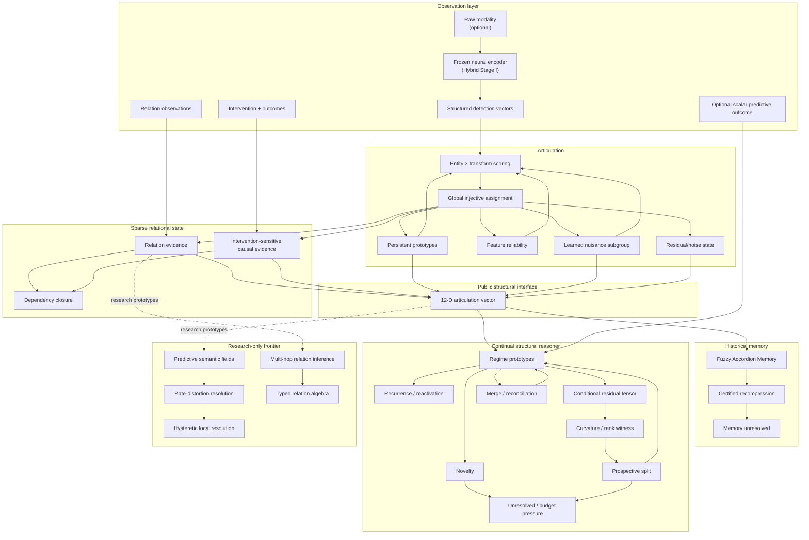

---

## 43. The architectural principle

All of these mechanisms point to one common design rule:

$$
\boxed{
\text{Use the smallest revisable structure that available evidence can justify.}
}
$$

Cortex therefore treats representation as something that may:

- appear;
- become more precise;
- recur;
- split;
- merge;
- be compressed;
- or remain unresolved.

The system is not designed around the assumption that the correct internal ontology is known in advance.

It is designed around the idea that **structure should be earned by evidence and remain reversible when the evidence changes**.

---

## 44. Further reading

For current project state and roadmap:

- [PROJECT_STATUS.md](PROJECT_STATUS.md)

For the frozen behavioral contract:

- [V1_CONTRACT.md](V1_CONTRACT.md)

For native migration and implementation status:

- [NATIVE_MIGRATION.md](NATIVE_MIGRATION.md)

For runtime profiling:

- [FULL_RUNTIME_BENCHMARK.md](FULL_RUNTIME_BENCHMARK.md)
- [NATIVE_SCALING_SWEEP_V1.md](NATIVE_SCALING_SWEEP_V1.md)
- [NATIVE_STAGE_ATTRIBUTION.md](NATIVE_STAGE_ATTRIBUTION.md)
- [ARTICULATION_ATTRIBUTION.md](ARTICULATION_ATTRIBUTION.md)

For the research lineage:

- [RESEARCH_HISTORY.md](RESEARCH_HISTORY.md)

For neural/Cortex integration:

- [HYBRID_STAGE_I.md](HYBRID_STAGE_I.md)

For software/specification/protocol versioning:

- [VERSIONING.md](VERSIONING.md)
